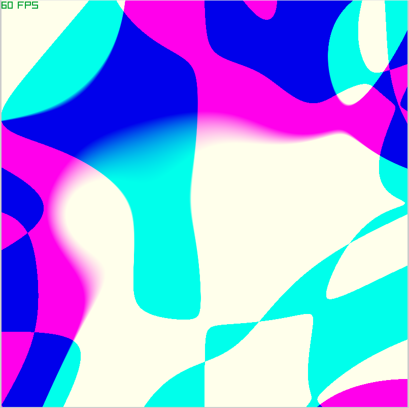

# Random Art Generator

## Overview
**Random Art** is a procedural generation tool written in C# using **Raylib-cs**. It creates abstract, mathematical art by generating random expression trees (Abstract Syntax Trees), converting them into GLSL fragment shaders, and rendering them in real-time.



The system uses a context-free grammar to construct mathematical functions taking coordinates $(x, y)$ and time $(t)$ as input, and outputting color vectors $(r, g, b)$.

## Features
* **Procedural Generation**: Creates unique, infinite variations of mathematical textures.
* **Real-time Rendering**: Runs as a GLSL shader, allowing for high-performance animation using the time variable.
* **Dual Modes**:
    * **GUI Mode**: View animations, regenerate seeds, and save/load expressions.
    * **CLI Mode**: Headless generation for exporting high-resolution static images.
* **Expression Saving**: Serializes the generated math tree to text files (partial support).
* **Complex Math Operations**: Supports arithmetic, trigonometry (via time), logic gates (`If`), and vector operations (`Triple`).

## Prerequisites
* [.NET SDK](https://dotnet.microsoft.com/download) (6.0 or later recommended)
* [Raylib-cs](https://github.com/ChrisDill/Raylib-cs) (NuGet package)

## Build & Installation

1.  **Clone the repository** (or create a project folder).
2.  **Add Dependencies**:
    ```bash
    dotnet add package Raylib-cs
    ```
3.  **Build**:
    ```bash
    dotnet build
    ```

## Usage

The application is controlled via command-line arguments to switch between GUI and CLI modes.

### 1. GUI Mode
Launches a window to view the generated art in real-time.

```bash
dotnet run gui -depth 20

```

**Controls:**
| Key | Action |
| :--- | :--- |
| **R** | **Regenerate**: Create a fresh random shader based on the grammar. |
| **S** | **Save**: Save the current expression tree to `Node.txt`. |
| **L** | **Load**: Load an expression tree from `Node.txt` and compile it. |

### 2. CLI Mode (Headless)

Generates a static image and saves it to disk without opening a visible window.

```bash
dotnet run cli -o output.png -depth 30

```

**Arguments:**

* `-o <file>`: Specifies the output filename (default: `Default_output_path.png`).
* `-depth <int>`: Specifies the recursion depth of the expression tree. Higher numbers create more complex detailed textures but take longer to generate.

## How It Works

1. **Grammar Definition**: The program defines a set of recursive rules (Grammar).
* *Example*: A generic node might branch into a generic number, a variable (), or a binary operation (, ).


2. **Tree Generation**: It builds a random Abstract Syntax Tree (AST) based on the specified `-depth`.
3. **Transpilation**: The C# AST is traversed and translated directly into a GLSL string.
* *C# Node*: `NodeADD([NodeX, NodeY])`
* *GLSL Result*: `(x + y)`


4. **Rendering**: Raylib compiles this string into a shader at runtime and renders it to a full-screen quad.

## References

* **Original Concept / Inspiration**: This project implements ideas related to "Random Art" and Hash Visualization.
* *Paper*: [Hash Visualization: a New Technique to improve Real-World Security](http://users.ece.cmu.edu/~adrian/projects/validation/validation.pdf)
